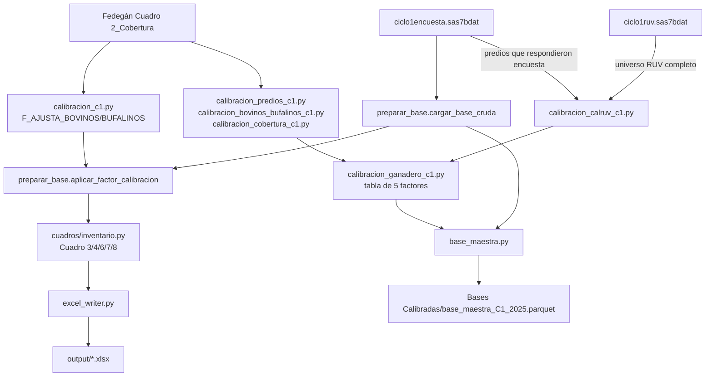

# Arquitectura

## Qué resuelve este proyecto

Los 3 programas SAS originales de Carolina (`Programas Carolina/4.1. cuadros
inventario.sas`, `4.2. cuadros ganadero.sas`, `4.3. cuadros predio
ganadero.sas`) calculan los cuadros de publicación de la Encuesta de
Caracterización Ganadera a partir del RUV (Registro Único de Vacunación) y la
encuesta que se aplica junto a la vacunación, calibrados contra el marco de
Fedegán. Este proyecto es la traducción de esos 3 programas a Python,
manteniendo la misma estructura y las mismas reglas de negocio, pero
recalculando de forma independiente cada factor de calibración en vez de
heredarlo de archivos intermedios de SAS/R.

## Decisión de diseño más importante: nunca heredar un factor sin recalcularlo

Varias veces durante el desarrollo se encontraron factores de calibración
heredados que estaban mal calculados (ver casos documentados en
`calibracion_c2.py` - un bug de notación científica en R que inflaba
`F_AJUSTA_BOVINOS` ~14 órdenes de magnitud; y en `calibracion_predios_c1.py` -
un error de universo, RUV completo vs. solo encuestados). Por eso la regla
del proyecto es:

> Ningún factor de calibración se usa "porque así viene" en un archivo
> heredado. Siempre se recalcula desde los datos crudos, se compara contra el
> heredado (cuando existe) para detectar discrepancias, y se documenta el
> resultado en el docstring del módulo.

Esto explica por qué casi todos los módulos `calibracion_*.py` tienen la
misma forma: cargar insumo crudo → calcular factor propio → comparar contra
heredado (si existe) → guardar el propio.

## Los 5 factores de calibración de Ciclo 1

| Factor | Fórmula | Módulo | Se aplica en |
|---|---|---|---|
| `calruv` | `cantpredganruv / cantpredganencuesta` (RUV completo / encuesta, por `predioganid`) | `calibracion_calruv_c1.py` | `peso_predio_ganadero` (`base_maestra.py`) |
| `cal_cobertura` | `1 / Total Predios Cobertura` (Fedegán) | `calibracion_cobertura_c1.py` | `peso_ganadero` / `peso_predio_ganadero` (`base_maestra.py`) |
| `cal_predios` | `Total Predios PM (Fedegán) / predios_encuesta` | `calibracion_predios_c1.py` | `peso_predio_fisico` (`base_maestra.py`) → Cuadro 1 "Total predios" |
| `cal_bovinos` / `cal_bufalinos` | `Total <especie> PM (Fedegán) / animales_encuesta` (`TOTAL_AFT_<esp> + TOTAL_AFT_<esp>_NV`) | `calibracion_bovinos_bufalinos_c1.py` | Factor de `calibracion_ganadero_c1.py`, aún sin cuadro que lo consuma |
| `F_AJUSTA_BOVINOS` / `F_AJUSTA_BUFALINOS` | `Total <especie> PM (Fedegán) / total_ruv` (suma de los 13 tramos de sexo/edad + su `_NV`) | `calibracion_c1.py` | `preparar_base.aplicar_factor_calibracion` → Cuadros 3/4/5/6/7 |

**`cal_cobertura` fue corregido el 2026-09-23**: la fórmula original era
`2 - Total Predios Cobertura` (coincidía EXACTO con el heredado de Carolina,
`calibrac12025.xlsx`). Fedegán define `Total Predios Cobertura` =
`Total Predios Vacunados / Total Predios PM`, así que la inversión exacta de
esa definición es `1/C`, no `2-C` (que es solo la aproximación lineal de
primer orden de `1/C`, válida solo cuando `C≈1`). Validado municipio a
municipio contra `Total Predios PM`: `1/C` reduce a la mitad el error
acumulado frente a `2-C` (486.7 vs 917.9 en 1055 municipios), y es exacto en
los casos de cobertura muy baja (ver docstring de `calibracion_cobertura_c1.py`).

**`cal_bovinos`/`cal_bufalinos` y `F_AJUSTA_BOVINOS`/`BUFALINOS` NO son lo
mismo**, aunque ambos son "Fedegán/RUV por municipio": usan denominadores
distintos (uno agregado desde `TOTAL_AFT_*_NV`, el otro sumando el detalle
real por tramos que multiplica `aplicar_factor_calibracion`) y tratan distinto
los municipios sin match en Fedegán (`cal_bovinos` deja el factor en 1.0;
`F_AJUSTA_BOVINOS` lo deja en 0, para que ese municipio no aporte su crudo sin
escalar). Confundirlos fue un error real durante el desarrollo - ver el
docstring de `calibracion_c1.py` para el detalle completo.

## Calibración del ganadero: 3 pesos de conteo, 3 unidades distintas

Los 5 factores de la tabla anterior no se usan directo en los cuadros de
"ganadero"/"predio-ganadero" - se combinan en 3 **pesos de conteo**
(`base_maestra.py`), uno por cada unidad que hay que contar. Cada fila de la
base maestra es un `predioganid` (par predio-ganadero, ya deduplicado); estos
pesos convierten "cuántas veces cuenta esa fila" en cada cuadro:

| Peso | Fórmula | Unidad que cuenta | Se usa en |
|---|---|---|---|
| `peso_ganadero` | `(1 / conteo_predios_ganadero) * cal_cobertura` | **Ganaderos** (personas) - `conteo_predios_ganadero` = cuántos `predioganid` tiene el mismo `IDENT_GANADERO` | Cuadro 1 "Total ganaderos", Cuadro 3 del libro "ganadero" (por sexo/persona jurídica) |
| `peso_predio_ganadero` | `calruv * cal_cobertura` | **Pares predio-ganadero** (relaciones, no parcelas - un predio con 2 ganaderos cuenta 2 veces) | Cuadro 1 "Total predios ganaderos" |
| `peso_predio_fisico` | `(1 / conteo_ganaderos_por_predio) * cal_predios` | **Predios físicos** (parcelas únicas, `CODIGO_SIT`) - `conteo_ganaderos_por_predio` = cuántos `predioganid` tiene el mismo `CODIGO_SIT` | Cuadro 1 "Total predios" |

`peso_ganadero` y `peso_predio_fisico` usan el MISMO patrón (1 / cuántas
filas comparten la llave del "dueño" del conteo, × un factor de Fedegán) -
evita que una entidad con varias filas (un ganadero con varios predios, o un
predio con varios ganaderos) se cuente más de una vez al sumar a nivel
municipio/nacional.

**Por qué existen 3, no 1**: la primera versión de Cuadro 1 usaba
`peso_predio_ganadero` (fórmula del SAS original, `4.2`/`4.3 cuadros
*.sas`, que trata "Total predios" y "Total predios ganaderos" como la MISMA
cantidad) también para "Total predios" - al validar contra el "Total Predios
PM" de Fedegán, esto sobreestimaba ~+25% de forma sistemática. La causa: un
predio con 2 ganaderos registrados se contaba 2 veces (`nunique(predioganid)`
= 729.874 a nivel nacional, vs `nunique(CODIGO_SIT)` = 584.069 predios
físicos - una diferencia de +24,96%, casi idéntica al +24,97% de brecha
contra Fedegán). `peso_predio_fisico`, calibrado con `cal_predios` (que sí
está construido para reconciliar exacto con Fedegán, igual que
`F_AJUSTA_BOVINOS/BUFALINOS`), corrige esto: aplicado a "Total predios",
reconcilia **exacto** contra Fedegán (+0,000%, ver
`validacion_totales_cuadro1_c1.py`) - decisión del usuario (2026-09-18):
mantener "Total predios ganaderos" con la fórmula original del SAS (pares
predio-ganadero, sin comparación posible con Fedegán, que no reporta esa
unidad) y separar "Total predios" a `peso_predio_fisico`.

`cal_bovinos`/`cal_bufalinos` quedan calculados en `calibracion_ganadero_c1.py`
pero **sin peso/cuadro que los use todavía** (no confundir con
`F_AJUSTA_BOVINOS/BUFALINOS`, que sí se usa en el libro de inventario).

## Fuente del RUV: `ciclo1encuesta.sas7bdat`, no `ciclo1ruv.sas7bdat`

Todo el pipeline de Ciclo 1 (inventario y base maestra) lee de
`ciclo1encuesta.sas7bdat` (el subconjunto de predios del RUV que ADEMÁS
respondieron la encuesta de caracterización), no de `ciclo1ruv.sas7bdat` (el
universo RUV completo). Se confirmó explícitamente (`preparar_base.py`,
`base_maestra.py`) que el número de `predioganid` únicos coincide EXACTO con
el que ya documentaba `base_maestra.py` (745.993) antes de que existiera esta
implementación - confirma que es la fuente correcta. `ciclo1ruv.sas7bdat` se
usa solo como referencia para calcular `calruv` (que necesita ambos
universos).

## Universo territorial completo (Nacional → Departamento → Municipio)

Todos los cuadros deben mostrar TODOS los municipios/departamentos, aunque no
tengan datos (quedan en 0). Esto se resuelve con un join completo (no inner)
contra el catálogo DIVIPOLA (`catalogo_territorial.py`), en `agregador.py` -
traducción directa de la macro SAS `%generar_cuadro_custom3`, presente e
idéntica en los 3 programas originales.

## Municipios excluidos del universo

44 municipios se excluyen de TODO el pipeline de Ciclo 1
(`config.MUNICIPIOS_EXCLUIDOS_C1`, aplicado en
`preparar_base.cargar_base_cruda`), por 3 motivos documentados en el
comentario de esa constante:

1. **<80% de cobertura de encuesta** (8 municipios) - idéntico y literal en
   los 3 programas SAS originales.
2. **Zona ZLSV** (4 municipios nuevos) - fuera del programa de
   vacunación/reporte de Fedegán ese ciclo, según archivo oficial.
3. **Encuestas repetidas** (32 municipios) - alta proporción de encuestas
   duplicadas, dato de encuesta no confiable, según archivo oficial.

## Plantillas Excel: nunca se reconstruyen desde cero

`excel_writer.py` siempre parte de la plantilla real de publicación (título,
encabezados multinivel, merges, notas al pie ya existen ahí) y solo
inserta/llena el bloque de filas de datos, clonando el estilo de celda de la
fila de ejemplo. Así el formato de salida es idéntico al oficial sin tener
que reconstruir el diseño en código.

## Un proceso por cuadro

`main.py` genera cada cuadro de inventario como una invocación de proceso
Python independiente (`--solo <paso>`), en vez de encadenarlos en un mismo
proceso: la máquina donde corre esto tiene poca RAM libre, y encadenar varios
cuadros pesados en un mismo proceso ya causó un `MemoryError` una vez.

## Diagrama del pipeline (Ciclo 1)

## Ver también

- [02_instalacion.md](02_instalacion.md) - insumos y cómo obtenerlos.
- [04_modulos.md](04_modulos.md) - detalle módulo por módulo.
- [05_flujo_datos.md](05_flujo_datos.md) - de dónde vienen los datos y qué transformaciones sufren.
