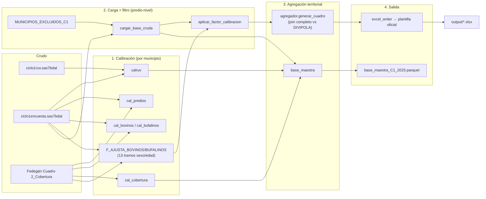

# Flujo de datos end-to-end (Ciclo 1)

## De dónde vienen los datos

| Fuente | Formato | Qué trae |
|---|---|---|
| `ciclo1ruv.sas7bdat` | SAS binario | Universo RUV completo Ciclo 1 2025 (todo predio vacunado) |
| `ciclo1encuesta.sas7bdat` | SAS binario | Subconjunto del RUV que además respondió la encuesta de caracterización - **fuente real del pipeline**, ver `01_arquitectura.md` |
| `1-Historico-PE-Inventario-Bovino-Bufalino...xlsx` (Fedegán) | Excel, hoja `Cuadro 2_Cobertura` | Marco de referencia: predios/animales "PM" (población meta) por municipio y ciclo |
| `para calibrar formulado fedegan.xlsx` | Excel, `Hoja3` | `municipio_id` (interno SAS) ↔ `CODIGO_MUNICIPIO` (DIVIPOLA), para los 1121 municipios |
| `DIVIPOLA_Municipios.xlsx` | Excel | Catálogo territorial completo (Nacional/Departamento/Municipio) |
| `calibrac12025.xlsx` / `calibraencuestac1.xlsx` (Carolina) | Excel | Factores heredados del pipeline SAS original - se usan **solo para comparar**, nunca directo |
| `Municipios ZLSV_OC_ciclos 2025.xlsx` / `Municipios Salen Encuestas repetidas...xlsx` | Excel | Listas oficiales de municipios a excluir (ver `config.MUNICIPIOS_EXCLUIDOS_C1`) |

## Transformaciones, en orden

## Nivel de agregación en cada paso

1. **Crudo** (`ciclo1encuesta.sas7bdat`): una fila por lote de vacunación en
   una visita a un predio (`FECHA_VACU`, `LOTE_AFT`, `NUMERO_VISITA`...).
2. **Calibración**: agregado a nivel **municipio** (`CODIGO_MUNICIPIO`) - un
   factor por municipio y especie.
3. **`cargar_base_cruda`**: nivel **predio** (una fila = un registro crudo,
   sin deduplicar) - los cuadros de inventario (4.1) no deduplican;
   `deduplicar_predio_ganadero` (usada solo por `base_maestra`) sí colapsa a
   una fila por `predioganid`.
4. **`aplicar_factor_calibracion`**: sigue a nivel predio, pero cada columna
   de inventario ya queda multiplicada por el factor de su municipio.
5. **`agregador.generar_cuadro`**: nivel **Nacional → Departamento →
   Municipio** - el nivel final que ve la plantilla Excel.

## Dónde se pierde/gana información en cada nivel

- **Municipios excluidos** (`config.MUNICIPIOS_EXCLUIDOS_C1`): sus predios
  nunca entran a `cargar_base_cruda` - desaparecen desde el paso 2, para
  cualquier cuadro.
- **Municipios sin match en Fedegán** (ej. Acandí/Unguía, hoy cubiertos por
  la exclusión anterior): su `F_AJUSTA_BOVINOS/BUFALINOS` es `0` - sus
  predios SÍ pasan por `cargar_base_cruda`, pero su inventario calibrado
  queda en cero en el paso 2.
- **Municipios con Fedegán pero sin ningún predio en el RUV**: no hay fila
  que multiplicar - el total de Fedegán para ese municipio simplemente no
  aparece en el calibrado. `agregador.generar_cuadro` igual muestra el
  municipio, en 0 (join completo contra DIVIPOLA).

Todo esto se audita automáticamente con
`validacion_totales_inventario_c1.py` (ver `04_modulos.md`).

## Ver también

- [01_arquitectura.md](01_arquitectura.md) - por qué cada decisión.
- [04_modulos.md](04_modulos.md) - detalle de cada módulo de este diagrama.
